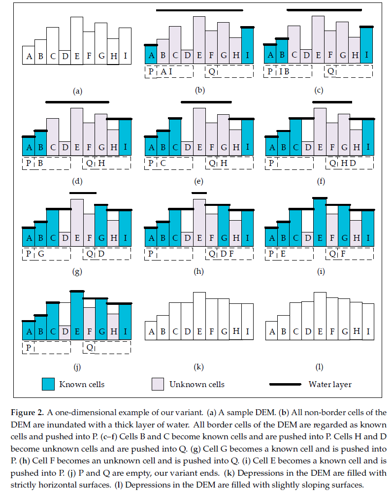

# An Implementation of the Modified Planchon and Darboux Algorithm

The script accepts a **.npy** file containing the Digital Elvation Model (DEM) from **numpy** array of data type **np.float64**. The output is the resulting sink-filled DEM using the modified Planchon-Darboux Algorithm by [Wei, Zhou, & Dong](https://www.mdpi.com/2220-9964/8/4/164) (2019).

The parameter **epsilon** ($\varepsilon$) controls the minium vertical gradient between nearby cells. This can be adjusted ($\varepsilon > 0$) so that the resulting sink-filled DEM can have have a slightly sloping profile aiding the flow accumulation methods by preventing perfectly flat areas.

The algorithm uses a similar priority queue and regular queue approach as the original [Planchon and Darboux Algorithm](https://www.sciencedirect.com/science/article/abs/pii/S0341816201001643) (2001).

## Usage
Clone the repository and run the following command in the terminal:
```cmd
cargo run <dem.npy> <0.0001> <outputfile.npy>
```

Or use the much faster release build:
```cmd
planchon_darboux <dem.npy> <epsilon> <outputfile.npy>
```

## General Idea
Written below is the psuedocode taken from the said reference.


```
Let DEM be the input  DEM
Let W be the covered water layer and converging to output DEM;
Let epsilon be a very small positive number;
Let m be a huge positive number;
Let P and Q be two emply plain queue;
Function dryCell(n) {
    W(n) = DEM(n);
    Push n into Pl
}

Stage 1: Initialization of the surface to m
For (each cell c in the DEM) {
    If (c is a border cell) {
        dryCell(c);
    } else {
        W(c) = m;
    }
}

Stage 2: Removal of excess water
While (P is not empty or Q is not empty) {
    If (P is not empty) {
        c = Pop first element from P;
    } else {
        c  = Pop first element from Q;
        If (DEM(c) >= W(c)) {
            continue;
        }
    }

    For each neighbor n of c {
        If (DEM(n) >= W(n)) {
            continue;
        }
        If (DEM(n) >= W(c) + epsilon) {
            dryCell(n);
        } Else if (W(n) > W(c) + epsilon) {
            W(n) = W(c) + epsilon;
            Push n into Q;
        }
    }
}
```

The image below was taken from the said article showing how it works for a one dimensional terrain model.




